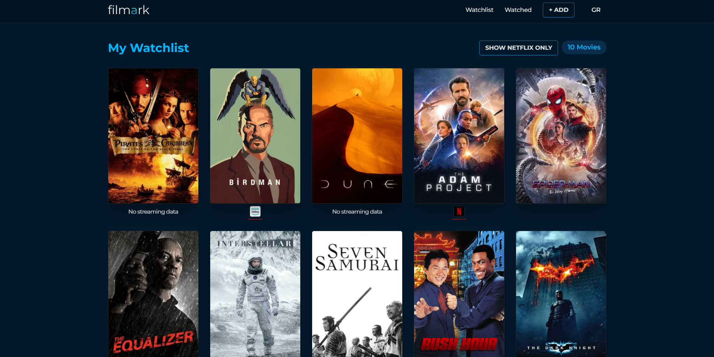
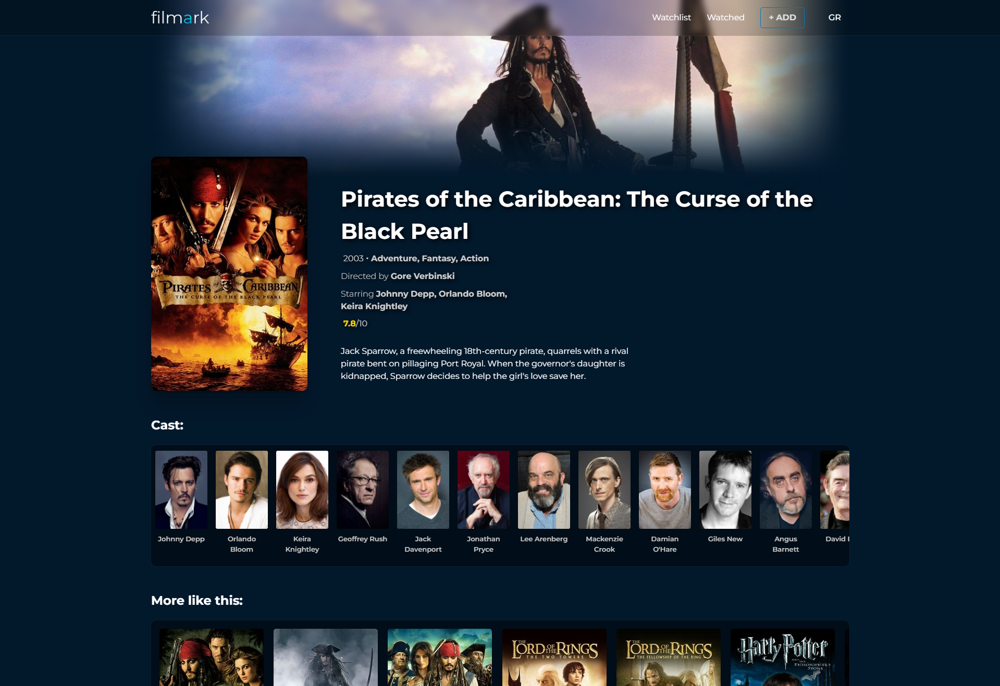

<h1 align="center">
  Filmark
  <br>
</h1>

<h4 align="center">A website for finding your favourite films and sorting them by streaming availability.<br>Uses TMDB API, created with React.</h4>
<hr>




<hr>

## Use locally

With [Git](https://git-scm.com) and [Node.js](https://nodejs.org/en/download/) installed on your computer, run:

```bash
# Clone repository
$ git clone https://github.com/miltosdoul/filmark

# Go into the repository
$ cd filmark

# Install dependencies
$ npm install

# Run the website
$ npm start
```

## Credits

This website uses the [TMDB](https://www.themoviedb.org) API for film data.

## License

GNU GPLv3
